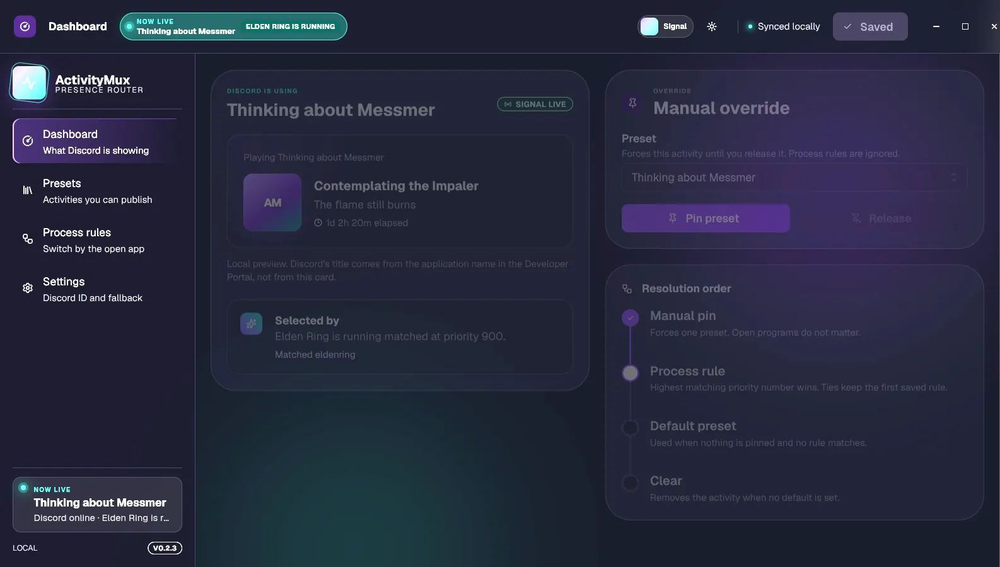

# ActivityMux

A desktop app for Windows and Linux that sets one Discord Rich Presence from presets, process rules, or a manual pin.

[](https://github.com/NaxeCode/activitymux/releases/latest)


[](https://naxecode.github.io/activitymux/)

[Website](https://naxecode.github.io/activitymux/) · [Download](https://github.com/NaxeCode/activitymux/releases/latest)



## What it does

- Custom presence presets and timers
- Running-process rules with priorities, matching any or all of a rule's processes
- Manual pin and default fallback
- Discord reconnect, tray mode, and autostart
- JSON import and export
- Windows and Linux support

ActivityMux controls only the presence it publishes. Discord game detection, Spotify, consoles, and other connected services remain separate.

## How it works

A background thread in the Rust backend runs one loop on a configurable poll interval (default 1 s, 500 ms to 60 s):

1. List running processes with `sysinfo` and normalize names (case, `.exe` suffix).
2. Resolve one preset: manual pin first, then the highest-priority enabled process rule that matches, then the default preset.
3. Publish that preset over Discord IPC (`discord-rich-presence`), reconnecting when Discord restarts and re-sending on a 15 s heartbeat.

Configuration is a versioned JSON file written through a temp file and backup, so an interrupted save does not leave a broken config. The React + Mantine UI talks to the backend through Tauri commands.

## Getting started

### Download

Get the latest installers from [Releases](https://github.com/NaxeCode/activitymux/releases/latest).

- Windows: use the `.exe` installer (an `.msi` and a portable `.zip` are also attached)
- Linux: use the `.AppImage` or `.deb`

Windows builds are currently unsigned, so SmartScreen may show a warning. `SHA256SUMS.txt` is attached to each release.

### Setup

1. Create an app in the [Discord Developer Portal](https://discord.com/developers/applications).
2. Name it as you want the activity title to appear.
3. Copy its Application ID from **General Information**.
4. Paste the ID into ActivityMux settings and save.

Discord takes the activity title and uploaded artwork from that application. A preset can use its own Application ID when it needs a different title or asset set. No bot token or client secret is needed.

### Build from source

Requires Node.js 22, Rust stable, and the [Tauri 2 prerequisites](https://v2.tauri.app/start/prerequisites/).

```bash
npm install
npm run tauri dev      # run with hot reload
npm run tauri build    # produce installers
cd src-tauri && cargo test
```

## Updates

Installed copies check GitHub Releases on startup and from Settings, then ask before downloading. Windows updates through the current-user NSIS installer. Linux updates the AppImage. The `.deb` package does not update itself.

Publish by tagging `vX.Y.Z` after that same version is set in `package.json`, `src-tauri/Cargo.toml`, and `src-tauri/tauri.conf.json`. The tag workflow signs the installers and uploads `latest.json`. The private key is the `TAURI_SIGNING_PRIVATE_KEY` repository secret, with a local backup at `~/.tauri/activitymux.key`. Do not commit it. Losing both copies means installed apps cannot verify later updates.

## Status

Released and in use, currently v0.2.x. Windows installers are not code-signed yet.

## How this project is run

[](https://linear.app)
[](AGENTS.md)
[](#how-this-project-is-run)

- **Planning:** work is tracked in Linear as initiatives → projects → milestones → issues; branches and PR titles carry the issue ID so status moves automatically from In Progress to Done.
- **Review:** every pull request gets an automatic Codex review guided by this repo's own Code Review Rules in [`AGENTS.md`](AGENTS.md), and review threads must be resolved before merge.
- **Guardrails:** the default branch (`main`) only changes through pull requests — no direct pushes or force-pushes.

## License

MIT

---
<sub>Built by [Aladdin Ali](https://github.com/NaxeCode) · [naxecode.github.io](https://naxecode.github.io)</sub>
